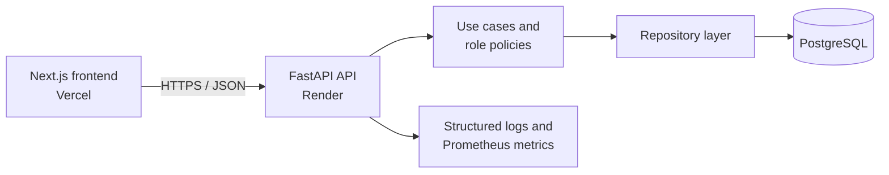

# Helpdesk Platform

[](https://github.com/Galya808/helpdesk-platform/actions/workflows/backend-ci.yml)
[](https://github.com/Galya808/helpdesk-platform/actions/workflows/frontend-ci.yml)

A full-stack, role-based helpdesk application built to demonstrate production-oriented backend development with FastAPI, PostgreSQL, automated testing, CI/CD, observability, and a lightweight Next.js interface.

[Live application](https://helpdesk-platform-five.vercel.app/) · [API documentation](https://helpdesk-api-ljn2.onrender.com/docs) · [Health check](https://helpdesk-api-ljn2.onrender.com/health)

> The API runs on Render's free tier. Its first request after inactivity can take up to a minute while the service starts.

## What the application does

The platform supports three roles with different permissions:

- **Customer** — register, sign in, create tickets, view own tickets, add comments, and follow allowed ticket status transitions.
- **Support agent** — view assigned and unassigned tickets, safely claim tickets, update permitted statuses and priorities, and communicate through comments.
- **Administrator** — manage users and roles, block accounts, view all tickets, and reassign tickets to active support agents.

The API also provides pagination and filtering, JWT authentication, password hashing, database migrations, structured request logs, request IDs, health checks, and Prometheus metrics.

## Architecture



The backend separates HTTP transport, business rules, and persistence:

```text
backend/app/
├── api/          # FastAPI routes and dependencies
├── comments/     # comment model, schemas, repository, and use cases
├── core/         # configuration, logging, metrics, and request context
├── database/     # async SQLAlchemy sessions and model registry
├── middleware/   # request logging and HTTP metrics
├── security/     # password hashing and JWT handling
├── tickets/      # ticket model, policies, repository, and use cases
└── users/        # user model, schemas, repository, and use cases
```

The design uses dependency injection, repository abstractions, explicit use cases, and a Strategy-style policy layer for role-specific status transitions. Row locking protects ticket assignment against concurrent updates.

## Technology stack

| Area | Technologies |
|---|---|
| Backend | Python 3.13, FastAPI, Pydantic |
| Persistence | PostgreSQL 18, async SQLAlchemy, asyncpg, Alembic |
| Authentication | JWT, Argon2 password hashing |
| Frontend | Next.js 16, React 19, TypeScript, Tailwind CSS |
| Testing and quality | pytest, pytest-asyncio, HTTPX, Ruff, mypy, ESLint |
| Operations | Docker, Docker Compose, GitHub Actions, Render, Vercel |
| Observability | JSON logging, request IDs, Prometheus metrics |

## Engineering practices demonstrated

- Layered architecture with business logic outside route handlers.
- SOLID-oriented design, composition, dependency injection, Repository and Strategy patterns.
- Unit, integration, API, authorization, and concurrency-focused tests.
- Async database access and transaction boundaries.
- Role-based authorization with non-disclosing `404` responses where appropriate.
- Safe password storage, JWT validation, secret-based configuration, and ORM-based queries.
- Automated formatting, linting, static type checking, migrations, tests, and frontend builds in CI.
- Containerized local and production environments.

## Run locally

### Prerequisites

- Docker and Docker Compose
- Node.js 24 or newer
- npm

### Backend and database

Create the backend environment file:

```bash
cp backend/.env.example backend/.env
```

Set a local JWT secret in `backend/.env`, then start PostgreSQL and the API:

```bash
docker compose up -d --build
```

The API is available at `http://127.0.0.1:8000`, with Swagger UI at `http://127.0.0.1:8000/docs`.

### Frontend

In a second terminal:

```bash
cd frontend
cp .env.example .env.local
npm ci
npm run dev
```

Open `http://localhost:3000`.

## Quality checks

Run backend checks from `backend/`:

```bash
uv sync --frozen
uv run ruff format --check .
uv run ruff check .
uv run mypy app tests
uv run pytest -q
```

Run frontend checks from `frontend/`:

```bash
npm ci
npm run lint
npm run build
```

GitHub Actions runs these checks for pushes and pull requests targeting `main`. Backend CI also starts PostgreSQL and applies all Alembic migrations before running the test suite.

## Deployment

- The frontend is deployed to Vercel.
- The Dockerized API and PostgreSQL database are deployed to Render.
- Alembic migrations run automatically when the backend container starts.
- Production configuration is supplied through environment variables; secrets are not committed.

See [DEPLOYMENT.md](./DEPLOYMENT.md) for deployment and verification instructions.

## API overview

| Area | Capabilities |
|---|---|
| Authentication | Registration, login, current user |
| Tickets | Create, list, filter, paginate, view, claim, change status and priority |
| Comments | Add and paginate ticket comments with role-based access |
| Administration | List users, change roles, block/unblock users, reassign tickets |
| Operations | Health endpoint, OpenAPI documentation, Prometheus metrics |

Detailed request and response schemas are available in the [interactive API documentation](https://helpdesk-api-ljn2.onrender.com/docs).

## Repository structure

```text
.
├── .github/workflows/  # backend and frontend CI
├── backend/            # FastAPI application and tests
├── frontend/           # Next.js application
├── compose.yaml        # local API and PostgreSQL services
├── render.yaml         # Render production blueprint
└── DEPLOYMENT.md       # deployment guide
```

## Project status

The MVP is complete and deployed. This project was created as a portfolio and learning project.
